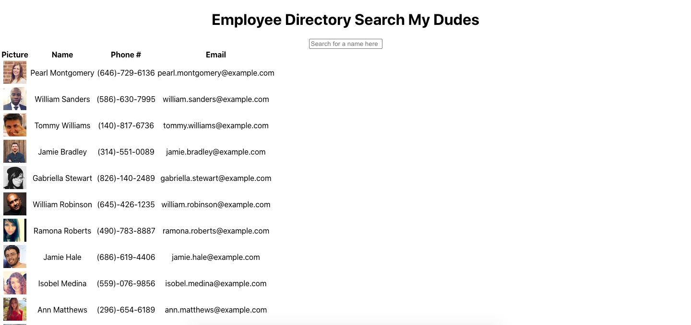

# Employee-Directory

Using React, I was able to create a working employee directory. Below shows a screenshot of the page. 

I know it's ugly, but you know it works so pick your battles here folks. 

You can type in the name of one of your employees, and their picture, first and last name, phone number and email will be shown. Wow, how clever. 

There is another readme that was created by React which tells you how to run the application from the raw code. 

Ciao
